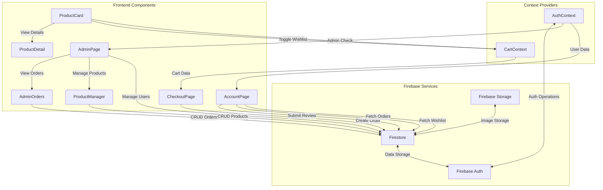
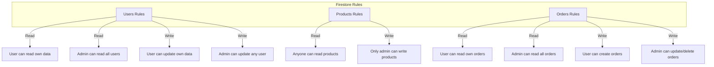

# E-Commerce Application Architecture and Data Flow

## Component Relationships and Data Flow



## Bug Fixes and Feature Implementation

```mermaid
graph TD
    subgraph "Heart Icon Fix"
        HI1[Move Heart Button Outside Link]
        HI2[Update toggleWishlist Function]
        HI3[Store in Firebase]
        HI4[Add Visual Feedback]
    end
    
    subgraph "Checkout Fix"
        CO1[Fix Order Structure]
        CO2[Update Firebase Rules]
        CO3[Fix Order Display]
    end
    
    subgraph "Account Settings"
        AS1[Change Password]
        AS2[Update Email]
        AS3[Notification Preferences]
        AS4[Delete Account]
    end
    
    subgraph "Review Feature"
        RF1[Update Order Interface]
        RF2[Add Review Button]
        RF3[Create Review Form]
        RF4[Store Reviews]
        RF5[Display Reviews]
    end
    
    subgraph "Admin Fixes"
        AD1[Fix Login Redirect]
        AD2[Fix Product Deletion]
        AD3[Fix User Ban/Delete]
        AD4[Fix Order Deletion]
    end
    
    subgraph "Visual Improvements"
        VI1[Fade-in Animations]
        VI2[Smooth Transitions]
        VI3[Loading Effects]
        VI4[Hover Animations]
    end
    
    HI1 --> HI2 --> HI3 --> HI4
    CO1 --> CO2 --> CO3
    AS1 --> AS2 --> AS3 --> AS4
    RF1 --> RF2 --> RF3 --> RF4 --> RF5
    AD1 --> AD2 --> AD3 --> AD4
    VI1 --> VI2 --> VI3 --> VI4
```



## Firebase Security Rules Structure



## Implementation Timeline

```mermaid
gantt
    title E-Commerce Bug Fixes Implementation Timeline
    dateFormat  YYYY-MM-DD
    section Critical Fixes
    Heart Icon Fix            :a1, 2025-07-26, 1d
    Checkout Fix              :a2, after a1, 1d
    Admin Login Redirect      :a3, after a2, 1d
    
    section Firebase Permissions
    Product Deletion Fix      :b1, after a3, 1d
    User Ban/Delete Fix       :b2, after b1, 1d
    Order Dashboard Fix       :b3, after b2, 1d
    
    section New Features
    Account Settings          :c1, after b3, 2d
    Order Reviews             :c2, after c1, 2d
    
    section Visual Improvements
    Animations & Effects      :d1, after c2, 2d